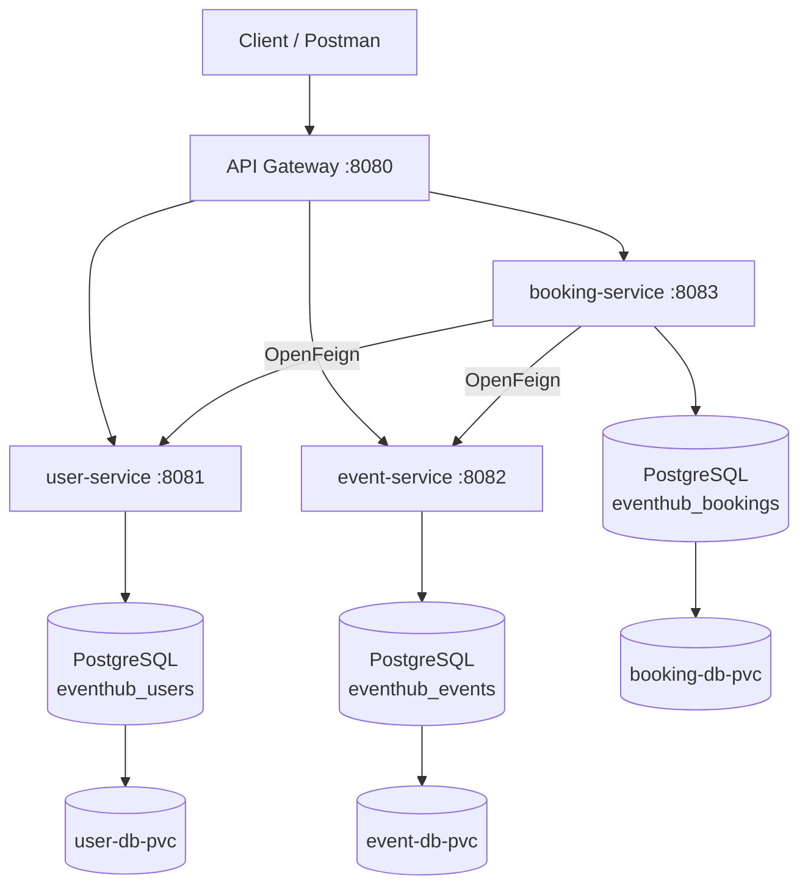

# EventHub

EventHub is a REST API for event and booking management built with a microservices architecture using Java and Spring Boot.

The application is composed of three independent business microservices and an API Gateway. Each microservice owns its own PostgreSQL database, while `booking-service` communicates with `user-service` and `event-service` through OpenFeign to validate users and events before creating a booking.

The project can be executed locally, with Docker Compose, or deployed to Kubernetes.

## Technologies

- Java 21
- Spring Boot 4.1.1
- Spring Web
- Spring Data JPA
- Hibernate
- PostgreSQL
- Spring Cloud OpenFeign
- Spring Cloud Gateway
- Jakarta Validation
- Lombok
- JUnit 5
- Mockito
- Maven
- Docker
- Docker Compose
- Kubernetes
- Git and GitHub

## Architecture



## Microservices

### user-service

Manages users and provides operations to create, retrieve and list users.

- Port: `8081`
- Database: `eventhub_users`
- Main endpoint: `/users`

### event-service

Manages events, including their name, description, location, date and capacity.

- Port: `8082`
- Database: `eventhub_events`
- Main endpoint: `/events`

### booking-service

Manages event bookings. Before creating a booking, it validates that both the user and the event exist by communicating with the corresponding microservices through OpenFeign.

- Port: `8083`
- Database: `eventhub_bookings`
- Main endpoint: `/bookings`
- Communicates with `user-service` and `event-service` using OpenFeign

### api-gateway

Provides a single entry point to the application and routes incoming requests to the appropriate microservice.

- Port: `8080`
- `/users/**` → `user-service`
- `/events/**` → `event-service`
- `/bookings/**` → `booking-service`

## API Endpoints

All requests can be made through the API Gateway at `http://localhost:8080`.

| Method | Endpoint | Description |
|---|---|---|
| POST | `/users` | Create a new user |
| GET | `/users` | Get all users |
| GET | `/users/{id}` | Get a user by ID |
| POST | `/events` | Create a new event |
| GET | `/events` | Get all events |
| GET | `/events/{id}` | Get an event by ID |
| POST | `/bookings` | Create a new booking |
| GET | `/bookings` | Get all bookings |
| GET | `/bookings/{id}` | Get a booking by ID |

### Create a booking

```http
POST /bookings
Content-Type: application/json
```

```json
{
  "userId": 1,
  "eventId": 1
}
```

Before storing the booking, `booking-service` verifies through OpenFeign that both the user and the event exist.

Example response:

```json
{
  "id": 1,
  "userId": 1,
  "eventId": 1,
  "status": "CONFIRMED"
}
```

## Running the Application

### Local Environment

Requirements:

- Java 21
- Maven
- PostgreSQL

Create the following PostgreSQL databases:

```text
eventhub_users
eventhub_events
eventhub_bookings
```

Set the database credentials as environment variables:

```powershell
$env:DB_USERNAME="postgres"
$env:DB_PASSWORD="your_password"
```

Start each microservice from its directory:

```powershell
cd user-service
.\mvnw.cmd spring-boot:run
```

```powershell
cd event-service
.\mvnw.cmd spring-boot:run
```

```powershell
cd booking-service
.\mvnw.cmd spring-boot:run
```

Finally, start the API Gateway:

```powershell
cd api-gateway
.\mvnw.cmd spring-boot:run
```

The services will be available at:

| Service | URL |
|---|---|
| API Gateway | `http://localhost:8080` |
| user-service | `http://localhost:8081` |
| event-service | `http://localhost:8082` |
| booking-service | `http://localhost:8083` |

Use the API Gateway at `http://localhost:8080` as the main entry point to the application.

### Docker Compose

Docker Compose can start the complete EventHub environment, including the three PostgreSQL databases, the three business microservices and the API Gateway.

First, build the application JAR files:

```powershell
cd user-service
.\mvnw.cmd clean package -DskipTests

cd ..\event-service
.\mvnw.cmd clean package -DskipTests

cd ..\booking-service
.\mvnw.cmd clean package -DskipTests

cd ..\api-gateway
.\mvnw.cmd clean package -DskipTests

cd ..
```

From the project root, build and start all containers:

```powershell
docker compose up --build -d
```

Check the running containers:

```powershell
docker compose ps
```

The API is available through the API Gateway:

```text
http://localhost:8080
```

To stop the environment while preserving the PostgreSQL data:

```powershell
docker compose down
```

Docker Compose uses named volumes to persist the data of each PostgreSQL database.

To also remove the persistent volumes and their stored data:

```powershell
docker compose down -v
```

> Use `docker compose down -v` only when you intentionally want to delete the database data.

### Kubernetes

The project includes Kubernetes manifests for the three PostgreSQL databases, the business microservices and the API Gateway.

### 1. Build the application JARs and Docker images

Build the JAR files first and then create the Docker images used by the Kubernetes manifests:

```powershell
cd user-service
.\mvnw.cmd clean package -DskipTests
docker build -t eventhub-user-service:k8s-v1 .

cd ..\event-service
.\mvnw.cmd clean package -DskipTests
docker build -t eventhub-event-service:k8s-v1 .

cd ..\booking-service
.\mvnw.cmd clean package -DskipTests
docker build -t eventhub-booking-service:k8s-v1 .

cd ..\api-gateway
.\mvnw.cmd clean package -DskipTests
docker build -t eventhub-api-gateway:k8s-v1 .

cd ..
```

These local images can be used directly with Docker Desktop Kubernetes. Other Kubernetes environments may require pushing the images to a container registry and updating the image references in the manifests.

### 2. Configure the Kubernetes Secret

The repository contains:

```text
k8s/eventhub-db-secret.example.yaml
```

Create a local copy:

```powershell
Copy-Item k8s/eventhub-db-secret.example.yaml k8s/eventhub-db-secret.yaml
```

Edit `eventhub-db-secret.yaml` and configure the PostgreSQL credentials:

```yaml
stringData:
  DB_USERNAME: postgres
  DB_PASSWORD: your_password
```

The real `eventhub-db-secret.yaml` file is ignored by Git and must not be committed.

Apply the Secret:

```powershell
kubectl apply -f k8s/eventhub-db-secret.yaml
```

### 3. Deploy the PostgreSQL databases

```powershell
kubectl apply -f k8s/user-service/user-db.yaml
kubectl apply -f k8s/event-service/event-db.yaml
kubectl apply -f k8s/booking-service/booking-db.yaml
```

Each PostgreSQL database uses a PersistentVolumeClaim (PVC) to preserve its data when a database Pod is replaced.

Check that the database Pods are running and the PVCs are bound:

```powershell
kubectl get pods
kubectl get pvc
```

### 4. Deploy the microservices

```powershell
kubectl apply -f k8s/user-service/user-service.yaml
kubectl apply -f k8s/event-service/event-service.yaml
kubectl apply -f k8s/booking-service/booking-service.yaml
kubectl apply -f k8s/api-gateway/api-gateway.yaml
```

Check the deployment:

```powershell
kubectl get pods
kubectl get services
```

All application Pods should eventually reach the `Running` state.

### 5. Access the API Gateway

For local Kubernetes environments such as Docker Desktop, the API Gateway can be accessed reliably using port forwarding:

```powershell
kubectl port-forward service/api-gateway 8080:8080
```

The API is then available at:

```text
http://localhost:8080
```

The Kubernetes manifest also exposes the API Gateway using NodePort `30081`. NodePort accessibility can depend on the networking configuration of the local Kubernetes environment.

> If the Docker Compose version of EventHub is running at the same time, stop it before using the same local ports with Kubernetes.

## Testing

The business logic is covered by unit tests using JUnit 5 and Mockito.

The project includes 17 custom unit tests:

| Microservice | Unit Tests |
|---|---:|
| user-service | 5 |
| event-service | 4 |
| booking-service | 8 |
| **Total** | **17** |

Mockito is used to isolate the service layer from repositories and external microservices, allowing the business logic to be tested independently.

Examples of tested scenarios include:

- Successful creation and retrieval of users
- Duplicate user email validation
- User not found scenarios
- Successful creation and retrieval of events
- Event not found scenarios
- Successful booking creation
- User and event validation during booking creation
- Handling unavailable external microservices
- Booking not found scenarios

To run the tests of a microservice:

```powershell
cd user-service
.\mvnw.cmd test
```

The same command can be executed from `event-service` and `booking-service`.

> The service-layer unit tests use Mockito and are isolated. The generated Spring Boot context tests load the application context and therefore require the corresponding database configuration to be available when running the complete test suite.

## Key Technical Decisions

- **Database per service:** each business microservice owns its own PostgreSQL database. This keeps data ownership separated and avoids direct database dependencies between microservices.

- **No cross-service JPA relationships:** `booking-service` stores only `userId` and `eventId` instead of creating JPA relationships with entities owned by other microservices.

- **Synchronous communication with OpenFeign:** before creating a booking, `booking-service` calls `user-service` and `event-service` to verify that the referenced resources exist.

- **API Gateway as a single entry point:** clients can access the application through port `8080` without needing to know the internal location of each microservice.

- **Environment-based configuration:** database connections and inter-service URLs can be configured through environment variables, allowing the same applications to run locally, with Docker Compose and on Kubernetes.

- **Persistent database storage:** Docker named volumes and Kubernetes PersistentVolumeClaims are used to preserve PostgreSQL data when containers or Pods are replaced.

- **Kubernetes Secrets:** database credentials are injected into the Kubernetes workloads through a Secret. The real Secret manifest is excluded from Git, while an example file is provided in the repository.

- **Versioned Kubernetes images:** Kubernetes uses versioned image tags such as `k8s-v1` instead of relying on `latest`, reducing the risk of running stale local images.

## Troubleshooting and Lessons Learned

| Problem | Cause | Solution / Lesson Learned |
|---|---|---|
| A Kubernetes service was still connecting to `localhost` | Kubernetes reused an older local image tagged as `latest` | Versioned image tags such as `k8s-v1` were introduced to ensure the expected application version is deployed |
| PostgreSQL PVC remained `Pending` | The PVC existed but was not mounted by the database Deployment | The PVC was connected using `volumes` and `volumeMounts`, allowing Kubernetes to provision and bind the storage |
| PostgreSQL reported `relation "users" does not exist` after switching to a fresh PVC | The database was recreated while the application was already running, so Hibernate had not initialized the new schema | Restarting the application Deployment caused Hibernate to run schema initialization against the new database |
| `booking-service` returned different data than expected | Its `DB_URL` did not include the `eventhub_bookings` database name | The environment variables inside the running Pod were inspected and the Kubernetes manifest was corrected |
| Port forwarding stopped working after a Deployment rollout | The original Pod used by the port-forward session had been replaced | The `kubectl port-forward` command was restarted after the rollout |
| Requests sometimes reached the Docker Compose environment instead of Kubernetes | Docker Compose and Kubernetes were using the same local ports simultaneously | The Docker Compose environment was stopped before testing Kubernetes |
| API Gateway NodePort was not reachable through `localhost` on the local cluster | NodePort accessibility depends on the networking implementation of the Kubernetes environment | `kubectl port-forward service/api-gateway 8080:8080` was used as the reliable local development method |

These issues provided practical experience debugging containerized and distributed applications using application logs, Kubernetes resources, environment variables, Pod lifecycle information and PostgreSQL itself.

They also highlighted the importance of explicit configuration, persistent storage, versioned container images and understanding the differences between local, Docker Compose and Kubernetes networking.

## Project Structure

```text
springboot-eventhub/
├── api-gateway/
│   ├── src/
│   ├── Dockerfile
│   └── pom.xml
│
├── user-service/
│   ├── src/
│   ├── Dockerfile
│   └── pom.xml
│
├── event-service/
│   ├── src/
│   ├── Dockerfile
│   └── pom.xml
│
├── booking-service/
│   ├── src/
│   ├── Dockerfile
│   └── pom.xml
│
├── k8s/
│   ├── api-gateway/
│   │   └── api-gateway.yaml
│   ├── user-service/
│   │   ├── user-db.yaml
│   │   └── user-service.yaml
│   ├── event-service/
│   │   ├── event-db.yaml
│   │   └── event-service.yaml
│   ├── booking-service/
│   │   ├── booking-db.yaml
│   │   └── booking-service.yaml
│   └── eventhub-db-secret.example.yaml
│
├── compose.yaml
├── .gitignore
└── README.md
```
